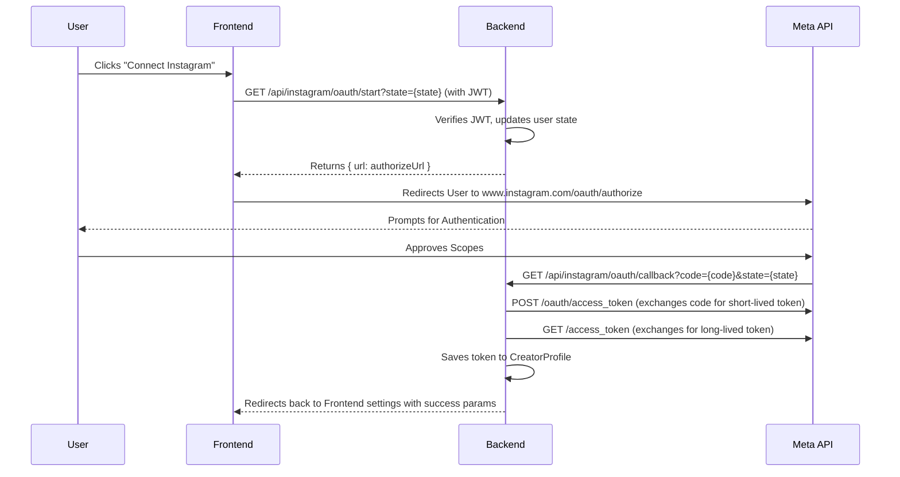

# Instagram Integration Runbook

This runbook documents the architecture, configuration, and troubleshooting procedures for the Instagram Business OAuth integration. Use this guide to restore Instagram login functionality within 15 minutes in the event of an outage.

## 1. Meta App Configuration
*   **App Type:** Business
*   **App Mode:** Development (until App Review is complete)
*   **App Name:** Instabrain
*   **Products Added:** Instagram API with Instagram Login
*   **Status:** Requires valid OAuth Redirect URIs to be configured in the Meta Dashboard.

## 2. Instagram App Configuration
*   **API Track:** Instagram API with Instagram Login
*   **Client ID:** Must use the **Instagram App ID**, NOT the Meta App ID.
*   **Required Scopes:** 
    *   `instagram_business_basic`
    *   `instagram_business_manage_insights`
*   *(Legacy consumer scopes like `instagram_graph_user_profile` are invalid for business analytics).*

## 3. Required Railway Variables
Ensure the following are perfectly matched in the Railway production environment:

```env
# Required Instagram OAuth Variables
META_CLIENT_ID=1016654697547047               # EXACT Match to Instagram App ID
META_CLIENT_SECRET=********                   # EXACT Match to Instagram App Secret
META_REDIRECT_URI=https://second-brain-backend-production-43b4.up.railway.app/api/instagram/oauth/callback
```
> [!WARNING]
> Do NOT use `INSTAGRAM_CLIENT_ID` in Railway. The backend controller maps strictly to `META_CLIENT_ID` and `META_REDIRECT_URI`.

## 4. OAuth Flow Diagram



## 5. Common Failures and Fixes

| Symptom | Root Cause | Fix |
| :--- | :--- | :--- |
| Frontend intercepts with `mock_code_888` | Backend failed to generate URL because `META_REDIRECT_URI` or `META_CLIENT_ID` is missing in Railway. | Add missing variables to Railway and re-deploy. |
| Meta displays "Invalid platform app" | `client_id` is using the Facebook Meta App ID instead of the Instagram App ID. | Change `META_CLIENT_ID` in Railway to the 16-digit Instagram App ID. |
| Meta displays "Invalid redirect_uri" | The URL in Railway doesn't strictly match the Meta Dashboard. | Ensure `META_REDIRECT_URI` has no trailing slash and is exactly registered in Meta. |
| Backend returns `401 Access token required` | The frontend failed to attach the `Authorization: Bearer` header. | Verify `getToken()` logic in `src/api/axios.ts`. |

## 6. Required Redirect URIs
This exact URL must be registered in the **Meta App Dashboard -> Instagram API with Instagram Login -> Valid OAuth Redirect URIs**:
*   `https://second-brain-backend-production-43b4.up.railway.app/api/instagram/oauth/callback`

## 7. Instagram Tester Setup
While the app is in Development mode:
1. Go to **Roles** -> **Roles** in the Meta App Dashboard.
2. Add the Instagram handle of the testing account as an **Instagram Tester**.
3. **CRITICAL:** The owner of that Instagram account must log into Instagram on the web, go to **Settings -> Apps and Websites -> Tester Invites**, and explicitly click **Accept**.
4. Testing will silently fail until the invite is accepted.

## 8. Deployment Checklist
- [ ] Railway environment variables `META_CLIENT_ID`, `META_CLIENT_SECRET`, and `META_REDIRECT_URI` are set.
- [ ] Backend URL generation includes `enable_fb_login=0&force_authentication=1`.
- [ ] Backend URL generation requests `instagram_business_basic,instagram_business_manage_insights`.
- [ ] `src/App.jsx` handles `instagram_connect=success` gracefully.

## 9. Verification Checklist
- [ ] Trigger OAuth via the frontend UI.
- [ ] Confirm URL bar displays `www.instagram.com/oauth/authorize`.
- [ ] Confirm `client_id` in URL matches `1016654697547047`.
- [ ] Complete login on Instagram.
- [ ] Confirm callback triggers `CreatorProfile` token update.
- [ ] Verify `instagram_access_token` exists in database.

## 10. Known Working Values
*   **Instagram App ID:** `1016654697547047`
*   **Meta App ID:** `1623304826461606` *(Do not use for Instagram OAuth endpoint)*
*   **Production API URL:** `https://second-brain-backend-production-43b4.up.railway.app`

---

## Post-Mortem: June 2026 Outage

**Incident:** Instagram OAuth flows failed continuously, trapping users in a mock fallback loop or hard-failing at the Instagram authorization screen with an "Invalid platform app" error.

**Root Causes:**
1.  **Missing Railway Variables:** The backend environment was missing `META_REDIRECT_URI`. Defensive code silently triggered a mock fallback URL, causing the frontend to inject a dummy `mock_code_888` which failed validation.
2.  **Wrong Client ID Configured:** While attempting to debug the issue, the `META_CLIENT_ID` was mistakenly set to the Meta App ID (`1623304826461606`) rather than the required Instagram App ID (`1016654697547047`). This caused the Instagram authorization endpoint to reject the request as an "Invalid platform app".
3.  **Invalid Scopes Request:** The authorization URL was requesting legacy consumer scopes (`instagram_graph_user_profile`, `instagram_graph_user_media`) rather than the modern scopes required for Business/Creator Insights (`instagram_business_basic`, `instagram_business_manage_insights`).

**Resolution:**
- Configured `META_REDIRECT_URI` correctly in Railway.
- Adjusted the URL generation logic in `instagram.controller.ts` to request business scopes and enforce `enable_fb_login=0`.
- Reverted `META_CLIENT_ID` in Railway to the proper Instagram App ID.
